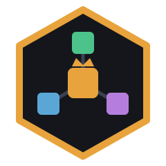
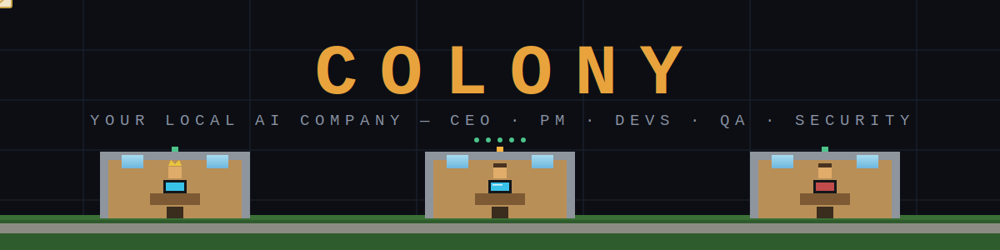
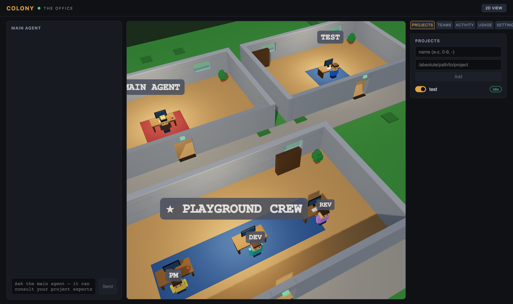
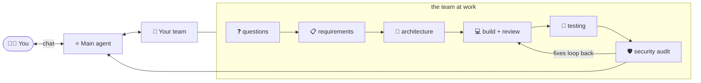
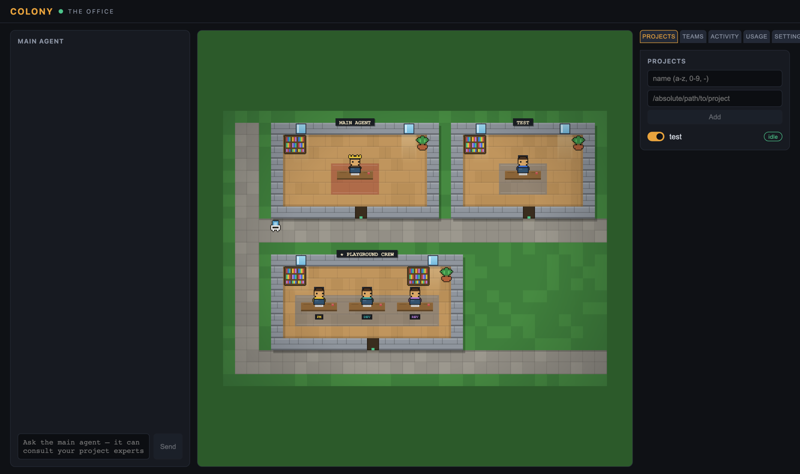

<div align="center">





**Run a company of AI agents on your own machine.**
You give the vision. Your main agent runs the team. The team ships the work.

[](LICENSE)
[](tsconfig.base.json)
[](https://docs.claude.com/en/api/agent-sdk/overview)
[](#-security-model)
[](#prerequisites)
[](https://github.com/LEXES7/Colony/pulls)

<br/>



*The live 3D office: every project and team gets a room. Monitors glow and characters type while agents actually work. Envelopes fly between rooms when agents talk to each other.*

</div>

---

## 🐝 What is Colony?

Colony is a **security-first, local multi-agent platform** built on the Claude Agent SDK. Point it at your project folders and each one gets a resident **expert agent** that knows that codebase. Ask the **main agent** a question like *"how did I implement auth in that other repo?"* and it consults the right expert and answers with file citations.

Then go further — put a **team** on a project and give it a mission:

> *"hey, let's build an ecommerce store"*

…and watch the org run it end-to-end, pausing to ask **you** for decisions at every gate.

## 🏛️ Company mode



The pipeline, with **you in the loop at every gate**:

| # | Stage | What happens |
|---|-------|--------------|
| 1 | Questions | The team studies the repo and sends its questions to your chat |
| 2 | Requirements | Your answers become a requirements doc — you approve or push back |
| 3 | Architecture | The design lands in `ARCHITECTURE.md` — you say *"start development"* |
| 4 | Build + review | ETA'd tasks get built, and every finished task is reviewed |
| 5 | Testing | Each requirement is traced through the real code, reported with `file:line` |
| 6 | Security audit | Vulnerabilities found become fix tasks automatically, then a re-audit |
| 7 | Delivery | The main agent inspects the result and hands you the delivery report |

While the team is waiting on you, a banner appears in the chat — your next message goes straight to them.

## ✨ Everything else it does

- 🗂 **Project experts** — toggle a folder on, get an agent that knows it. The main agent consults experts instead of re-reading codebases.
- 📋 **Task boards with ETAs** — every task gets an estimate; boards show live countdowns, overdue flags, and `took 8m vs eta 10m` receipts.
- 🏢 **The office** — default **3D voxel view** (orbit, zoom, click rooms) plus a crisp HD **2D pixel view**. Every teammate gets their own desk, color, and glowing monitor.
- 🖥 **Desktop app** — `pnpm desktop` opens Colony in its own native window; it boots and shuts down the server for you.
- 🪙 **Token counters** — per-agent input/output/cache/cost meters, always visible.

<div align="center">


*The 2D HD view — same office, retina pixel-art rendering.*
</div>

## 🚀 Quick start

**Prerequisites:** Node ≥ 18, [pnpm](https://pnpm.io), and Claude credentials — either be logged into [Claude Code](https://claude.com/claude-code) on this machine (subscription, no API key needed) or set `ANTHROPIC_API_KEY` in `.env`.

```bash
git clone https://github.com/LEXES7/Colony.git
cd Colony
pnpm install
pnpm dev          # or: pnpm desktop
```

The server prints a one-time URL with your access token:

```
Open the dashboard: http://localhost:5173/#token=…
```

1. Open it and set your **workspace root** (the folder your projects live in).
2. Add a project → toggle it **on** → a ~200-word summary is cached.
3. **Teams tab** → create a team (one-click member presets) → type a venture → **Start venture**.
4. Talk to your main agent. Run your company.

> **Note on subscription auth:** using your own Claude login is for your own local use — don't host Colony for other people on top of it. Costs shown on subscription are estimates.

## 🔐 Security model

Security is the first design constraint, not a feature:

| Defense | What it stops |
|---|---|
| Binds `127.0.0.1` only | anyone else on your network |
| 256-bit token on every API call + WebSocket | malicious websites scripting `localhost` (CSRF) |
| `Host`/`Origin` validation | DNS-rebinding attacks |
| Workspace-root **path jail** (symlinks resolved) + denylist (`~/.ssh`, `~/.aws`, `~/.claude`, `/etc`, …) | agents being aimed at your credentials |
| Read-only tools for most agents — **no shell, ever** | prompt injection escalating to code execution |
| Developer writes jailed to the team's folder | a rogue task touching anything outside its project |
| Secret-file deny hook (`.env*`, keys, credentials) | agents reading secrets even when asked |
| All runtime state in gitignored `data/` | leaking tokens/registry into a public repo |

A prompt injection hidden in a repo an agent reads can, at worst, produce a wrong *answer* — never execute code or exfiltrate data.

## 🪙 Token optimization

Haiku for experts and summaries, Sonnet where it counts, per-member overrides. Cached project summaries instead of codebases in context. Session resume so repeat questions cost ~10 fresh tokens. Hard turn caps on every phase. Tool pruning so unused tool schemas never enter context. Live usage meters so regressions are visible immediately.

## 🗺️ Roadmap

- Git integration: branch per task, real diffs in review, automated pushes
- Parallel task execution + task dependencies
- Main agent auto-routing ventures to the right team
- Standup mode: periodic re-planning against actual progress

## 📄 License

[MIT](LICENSE) — build your own colony.

<div align="center">
<sub>Built with the <a href="https://docs.claude.com/en/api/agent-sdk/overview">Claude Agent SDK</a> · runs entirely on your machine</sub>
</div>
